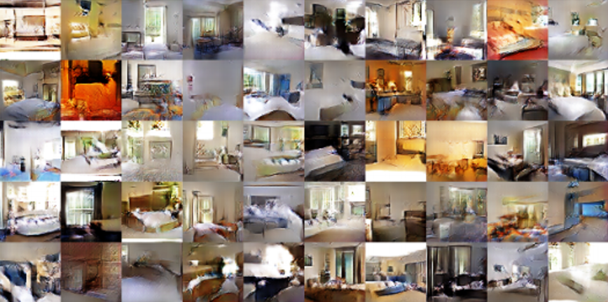
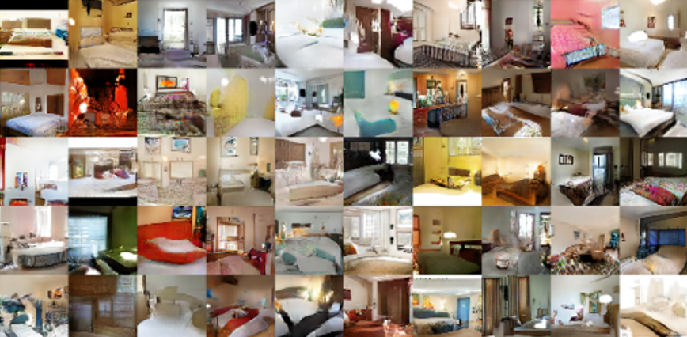
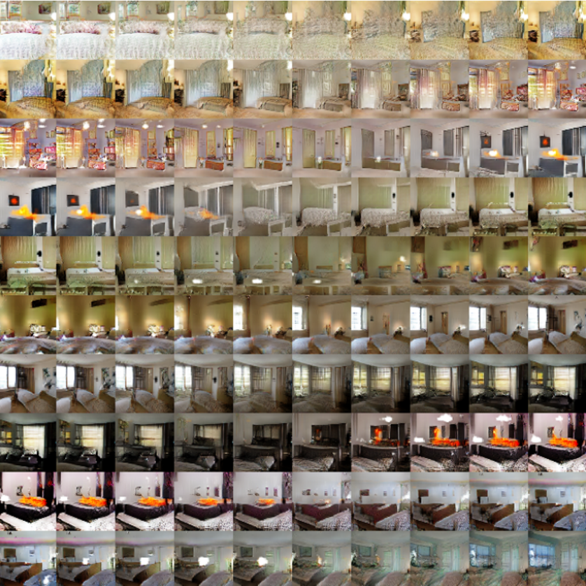
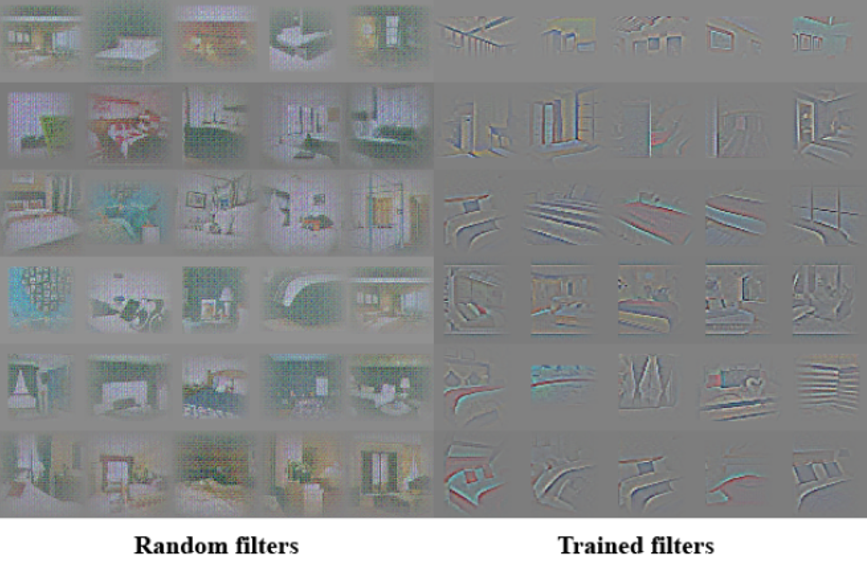
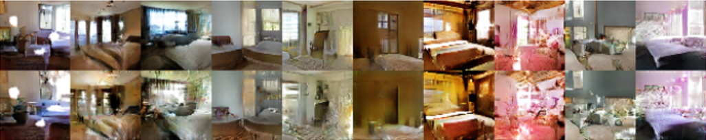
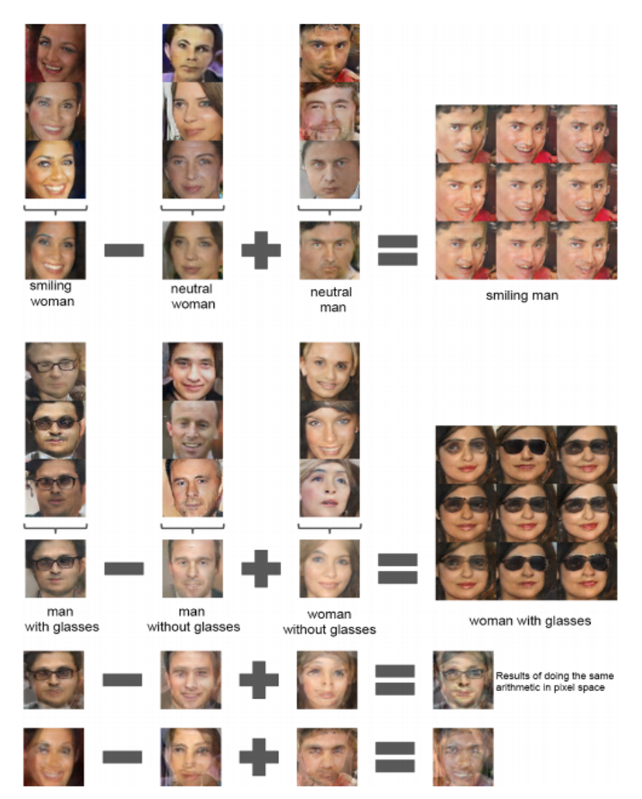
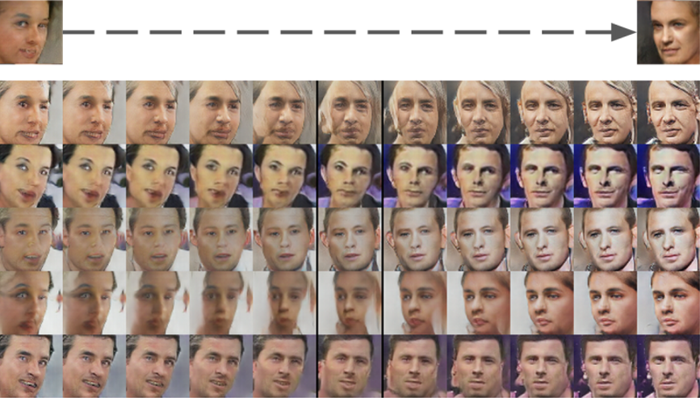

# DCGAN

* ####  Unsupervised Representation Learning with Deep Convolutional Generative Adversarial Networks

  * 대부분의 환경에서 안정적으로 학습이 가능한 Convolution GAN 구조를 제안. 이후 대부분의 GAN이 이 논문의 구조를 차용
  * Conv layer의 특정 filter들이 이미지의 특정 물체를 학습함을 보임
  * 이미지의 Sementic Quaility를 벡터 산술 연산으로 제어함. 모델이 이미지를 단순 1:1 Mapping하는것이 아님을 증명

 

* #### 등장 배경

  * 기존의 GAN은 MNIST 수준의 저화질 데이터를 생성하는것에 그치고, 고화질 데이터에 대해서는 좋은 성능을 보여주지 못함
  * 또한 두가지 모델을 동시에 training하기 때문에 학습 과정이 불안정함. ex) saddle point
  * CNN 구조의 black box를 풀고자 함

 

* #### Model Architecture Approach

  * 이전에도 GAN에 Conv 구조를 적용하고자 하는 시도는 있었으나 성공적이지 못했음. 본 논문에서는 실험**(extensive)**을 통해 안정적으로 학습할 수 있는 네트워크 구조를 찾음. Pooling과 Dense를 없애는 등 최신 CNN의 트렌드가 반영됨

     1. Pooling Layer를 Strided Convolution(D)과 fractional-strided Convolution(G)로 대체. fractional-strided convolution이란 Transposed Convolution을 말함

       

     2. 두 모델에 BatchNormalization 사용. 이때 모든 Layer에 사용하는것은 아니고, G의 Output Layer와 D의 Input Layer에도 사용하지 않음
     -> Gradient smoothing이 Mode Collapsing을 완화해주지만 학습의 대상이 되는 Original Image의 변질은 Generation task에 좋지 못한 영향을 끼치기 때문이 아닐까 예상됨

     3. Fully Connected Layer 제거

       

     4. Generator의 모든 활성화함수로 ReLU 사용. 이때 Output만 Tanh 사용

       

     5. Discriminator의 모든 활성화함수로 LeakyReLU 사용 

      

  * **Empirical research, testing(노가다)의 결과물이기 때문에 명확한 이유를 알기 어려움**

 

* #### Experiment (중요)

  * LSUN

    * Generator의 data memorizing(overfitting)을 막기 위해 서로 유사한 형태를 띄는 데이터를 모두 삭제하고 실험을 진행함. 약 275000개의 데이터를 삭제

    

     

    

    * 순서대로 1 epoch 학습한 후의 결과와 5 epoch 학습한 후의 결과. Overfitting이 일어나기엔 아주 낮은 학습 횟수임에도 불구하고 생성된 데이터들의 퀄리티가 상당히 높음. 심지어 두번째 결과는 아직 underfitting된 상태라고 말함. memorizing이 발생하지 않았음을 증명

      

      

    * 9개의 random vector를 보간(interpolation)하며 이미지를 생성한 결과. 벡터에서 벡터로 넘어갈때, 이미지도 자연스럽게 보간되는것을 확인할 수 있음. 특히, 6번째 줄에서 점차 창문이 생기는 부분이나, 10번째 줄에서 TV가 창문으로 변화하는 부분은 굉장히 자연스러움. 논문에서는 이를 Walking in the Latent space라고 표현

      

      

    * 오른쪽의  Trained Filter Visualize 결과, 각 필터가 침대나 창문 등, 어느정도 특정한 Object를 담당해 학습했다는 것을 알 수 있음. 반대로 왼쪽의 Random filter는 단순히 이미지를 그대로 memorizing함. 

      

      

    * 윗쪽은 un-modified model output, 아랫쪽은 "window"를 담당하는 filter를 dropout시킨 후 생성한 output. window가 위치하던 자리엔 어색하지만 주변과 유사한 형태로 대체됨. 모델이 아주 잘 학습되었고, 반대로 의도적으로 망각시키는 것도 가능한것으로 볼 수 있을듯

      

  * Faces

    

    * 이미지에 대한 벡터 산술 연산 결과. 연산의 operand image는 각각의 class에 해당하는 이미지 3개의 mean vector를 사용해서 연산함. 아래쪽의 단순 픽셀 연산 결과에 비해 상대적으로 자연스러운 결과가 생성된 것을 볼 수 있음.

      

      

    * 왼쪽을 쳐다보는 얼굴에서 오른쪽을 쳐다보는 얼굴로 보간을 사용해서 "Turn" 한 결과.

      

  * 위 실험 결과들은 모델이 latent vector를 output image와 단순히 1:1 mapping을 하는 것이 아닌, 데이터를 **이해**하고 있다는 것을 뒷받침함

    

    

    

